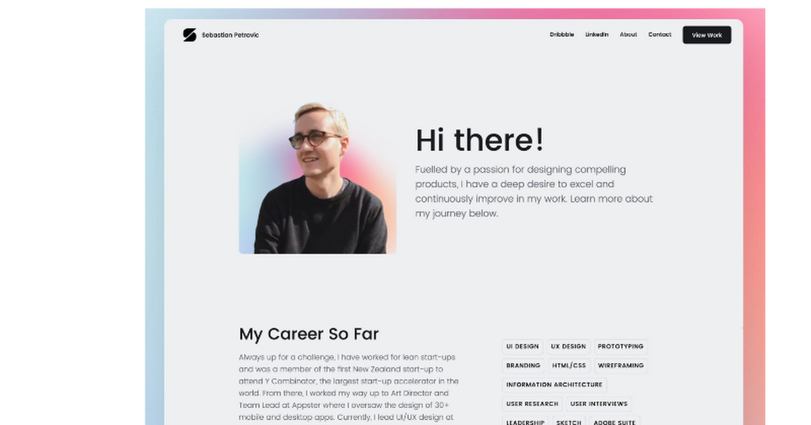
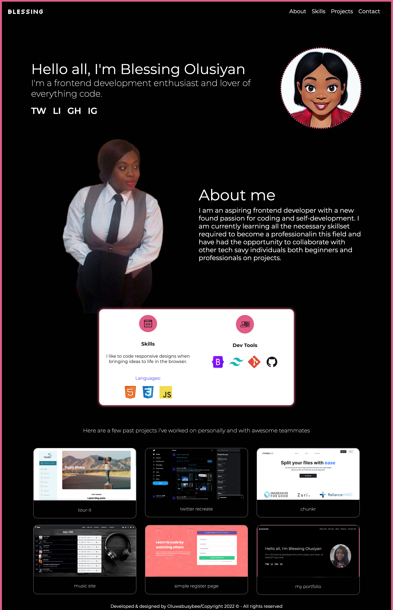
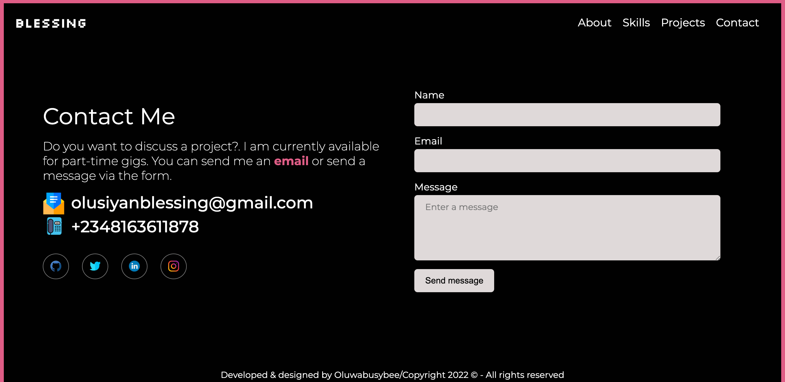

## About
Stutern HTML/CSS task - portfolio creation.

## Requirement
Create a portfolio site for self; a reference is attached below indicating your

- an image of yourself or anything you prefer
- a statement / an introduction
- a little bit about yourself
- your skill set list

1. take a screenshot of your portfolio in the browser: [how to screenshot](https://www.businessinsider.com/guides/tech/how-to-screenshot-on-google-chrome?r=US&IR=T)
2. attach the screenshot to your citrone submission and submit the link to the repository
Note: you get full grade for both the screenshot and code. If you don’t know how to attach document on citrone ask.

## Images
- Referenced site

- My portfolio site

## Acknowledgement
- Stutern

## Resources
- w3schools
- Stack overflow

